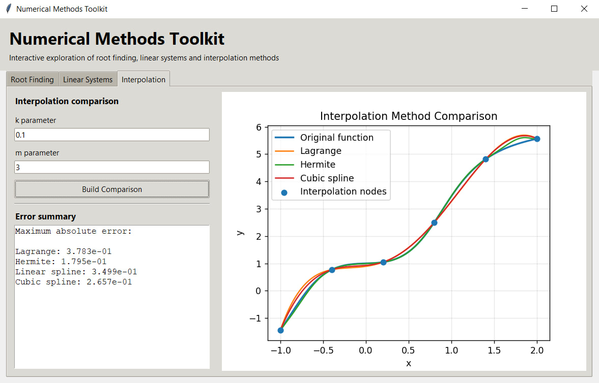
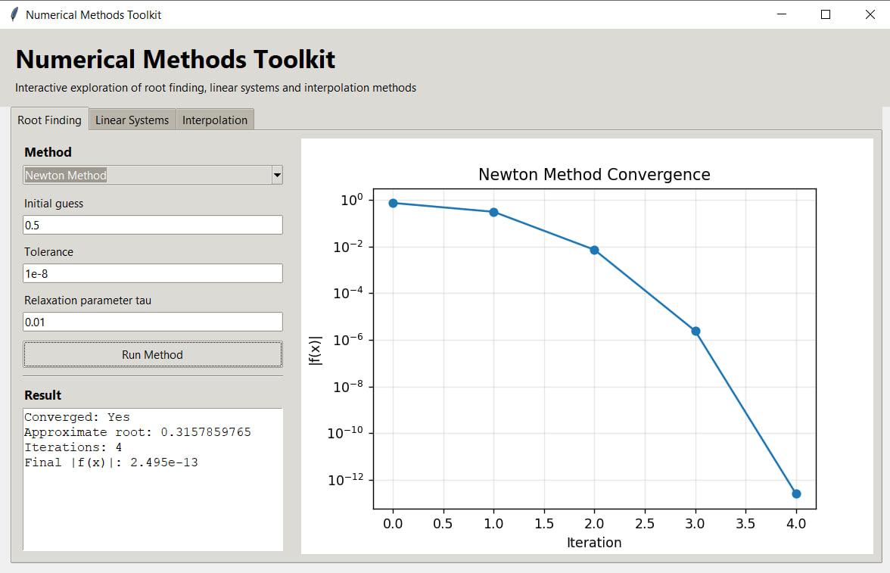
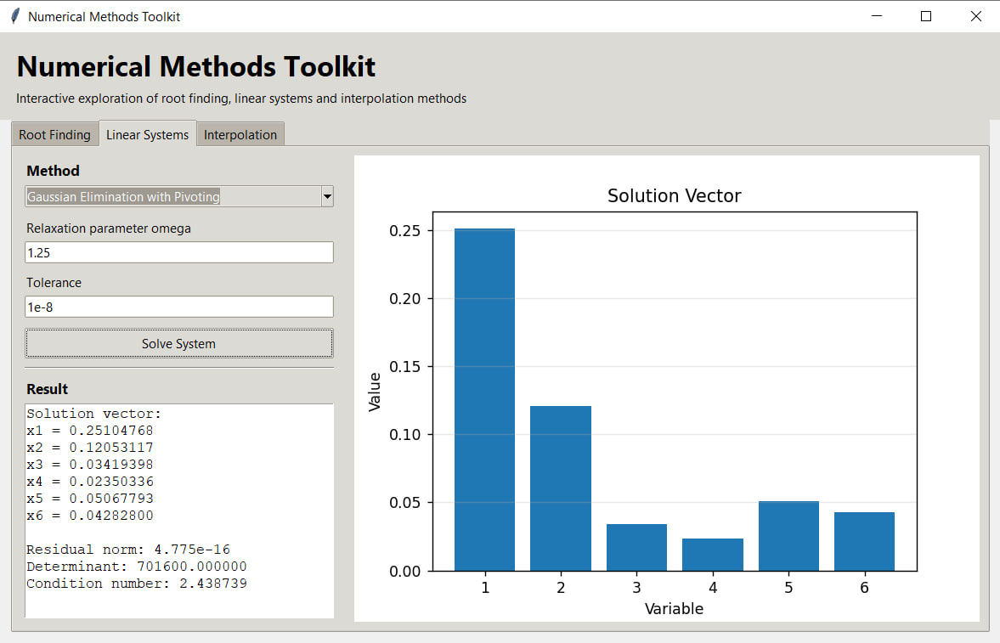

# Numerical Methods Toolkit

An interactive Python desktop application for exploring, visualizing, and comparing classical numerical methods.

The project combines numerical algorithms, convergence analysis, error estimation, and interactive visualization in a single graphical interface. It was developed to demonstrate practical implementation of numerical analysis techniques rather than relying only on built-in numerical solvers.



---

## Overview

Numerical Methods Toolkit provides an interactive environment for experimenting with several fundamental numerical algorithms.

The application is organized into three main modules:

- Root Finding
- Linear Systems
- Interpolation

Each module provides numerical results together with graphical visualization or numerical diagnostics, making it possible to analyze both the result and the behavior of the algorithm.

---

## Features

- Interactive desktop GUI built with Tkinter
- Visualization of numerical algorithm behavior
- Convergence analysis
- Numerical error estimation
- Residual analysis for linear systems
- Condition number and determinant calculation
- Comparison of interpolation techniques
- Adjustable numerical parameters
- Graphical representation of computational results

---

## Implemented Numerical Methods

### Root Finding

#### Newton Method

Newton's method is implemented as an iterative technique for solving nonlinear equations.

The application displays:

- approximate root
- number of iterations
- final residual
- convergence status
- logarithmic convergence plot

#### Relaxation Method

An iterative relaxation approach is also available.

The user can control the relaxation parameter and convergence tolerance to investigate how parameter selection affects convergence.

---

## Linear Systems

### Gaussian Elimination with Partial Pivoting

The application solves systems of linear equations using Gaussian elimination with pivot selection.

In addition to the solution vector, the program calculates:

- residual norm
- matrix determinant
- condition number

These diagnostics provide information about the numerical quality and stability of the computed solution.

### Successive Over-Relaxation (SOR)

The SOR method provides an iterative alternative for solving linear systems.

The relaxation parameter can be adjusted to investigate its influence on convergence.

---

## Interpolation

The interpolation module compares several approximation techniques on the same set of interpolation nodes.

Implemented methods:

- Lagrange Polynomial Interpolation
- Hermite Polynomial Interpolation
- Linear Spline Interpolation
- Cubic Spline Interpolation

The original function and all approximations are plotted together.

The application also calculates the maximum absolute error for each interpolation method, allowing their numerical accuracy to be compared directly.

---

## Application Preview

### Interpolation Method Comparison

The interpolation module compares multiple approximation techniques against the original function and displays interpolation nodes.


The application also reports the maximum absolute approximation error for every implemented interpolation method.

---

### Newton Method Convergence

Newton's method convergence is visualized using the absolute residual on a logarithmic scale.



The interface reports the computed root, number of iterations, convergence status, and final residual.

---

### Gaussian Elimination

The linear systems module visualizes the computed solution vector and provides additional numerical diagnostics.



The result includes the residual norm, determinant, and condition number of the system matrix.

---

## Technologies

- Python
- NumPy
- SciPy
- Matplotlib
- Tkinter

---

## Project Structure

```text
numerical-methods-toolkit/
│
├── numerical_methods_toolkit.py
├── requirements.txt
├── README.md
│
├── newton-method.png
├── gaussian-elimination.png
└── interpolation-comparison.png
```

---

## Installation

Clone the repository:

```bash
git clone https://github.com/panovadarina0761/portfolio.git
```

Navigate to the project directory:

```bash
cd portfolio/numerical-methods-toolkit
```

Install the required dependencies:

```bash
pip install -r requirements.txt
```

---

## Running the Application

Run:

```bash
python numerical_methods_toolkit.py
```

The application will open as a desktop GUI.

Use the tabs at the top of the interface to switch between:

- Root Finding
- Linear Systems
- Interpolation

Select the desired method, configure its parameters, and run the numerical experiment.

---

## Numerical Analysis

The project focuses not only on obtaining numerical solutions but also on evaluating their quality.

Depending on the selected method, the application provides metrics such as:

- convergence rate
- iteration count
- residual magnitude
- maximum absolute interpolation error
- matrix condition number
- matrix determinant

This makes the toolkit useful for studying the numerical behavior of different algorithms and comparing their performance.

---

## Motivation

The purpose of this project is to combine my background in Applied Mathematics with practical Python software development.

It demonstrates experience with:

- numerical algorithm implementation
- mathematical modeling
- iterative methods
- interpolation techniques
- numerical error analysis
- scientific computing
- data visualization
- GUI development
- software organization

---

## Possible Future Improvements

Future versions could include:

- additional root-finding algorithms such as the Bisection and Secant methods
- LU and QR decomposition
- Jacobi and Gauss-Seidel iterative methods
- numerical integration methods
- numerical differentiation
- user-defined matrices and functions
- convergence comparison between algorithms
- export of numerical results
- automated testing of numerical methods


Applied Mathematics graduate and Software Engineering Master's student interested in algorithms, optimization, mathematical modeling, numerical methods, and Python development.
